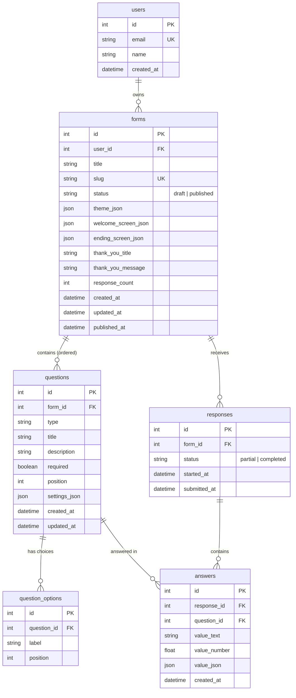

# Formly — Typeform Clone

> **SDE Fullstack Hiring Assignment:** A pixel-faithful, production-grade Typeform clone featuring the signature conversational one-question-at-a-time respondent flow, a 3-panel drag-and-drop builder, real-time database persistence, and a complete results/analytics dashboard.

---

## 🌟 Demo & Overview

Formly recreates the core Typeform experience from the ground up:
- **Respondent Flow:** Conversational, one-question-at-a-time animated flow (`<FormRunner>`) with direction-aware transitions (up/down slide + fade), full keyboard controls (`Enter`, `↑/↓`, `A/B/C`, `Y/N`, `1-N`), Karla typography, and field-level validation.
- **3-Panel Form Builder:** Drag-and-drop question reordering with `@dnd-kit`, inline title/description editing, right-panel properties inspector, choices editor, and instant in-memory preview.
- **Workspace Dashboard:** Form cards with live status badges (`Draft` / `Published`), response counters, search, status filters, sorting, duplicate, rename, delete with cascade, and share modal.
- **Results & Analytics:** 4 overview metric cards (Total Responses, Completed vs Partial, Completion Rate, Average Completion Time), visual per-question breakdowns across all 8 question types, paginated responses table, slide-over answer drawer, and streaming CSV export.
- **Zero Mock Data:** Backed by a normalized SQLite database with foreign key cascade deletion, server-side validation for all 8 types, and idempotent auto-seeding.

---

## 🏗 Tech Stack

| Layer | Technologies | Rationale |
|---|---|---|
| **Frontend** | Next.js 16 (App Router), TypeScript, Tailwind CSS | High performance, static/dynamic hybrid rendering, strictly typed schemas. |
| **Animation** | Framer Motion | Direction-aware slide and fade transitions matching Typeform's signature feel. |
| **Drag & Drop** | `@dnd-kit/core`, `@dnd-kit/sortable` | Accessible, accessible keyboard and pointer sortable lists for question ordering. |
| **Data Fetching** | TanStack Query (React Query) | Declarative caching, background refetching, optimistic updates, and cache invalidation. |
| **Typography** | Inter (UI & Builder) + Karla (Respondent Flow) | Exact font matching per Typeform design specifications. |
| **Backend** | Python FastAPI, Uvicorn | Async ASGI framework with native Pydantic v2 validation and auto-generated Swagger UI. |
| **ORM / DB** | SQLAlchemy 2.0 + SQLite (`PRAGMA foreign_keys=ON`) | Normalized relational schema with strict cascade deletes and clean migration readiness. |
| **Testing** | Pytest, HTTPX | Automated test suite validating database models, cascade deletions, routers, and metrics. |

---

## 📐 Database Schema & Architecture

The database architecture uses a **normalized 1-row-per-question** schema for answers rather than an untyped JSON blob. This ensures fast relational querying, aggregation for analytics, and integrity via foreign keys.



### Relational Design Decisions
1. **`answers` Table with Composite Uniqueness:**
   - Enforced by `UNIQUE(response_id, question_id)`.
   - Each answer row stores typed values (`value_text` for strings/emails/dates, `value_number` for numeric ratings/scores, `value_json` for multiple-choice selections).
2. **Explicit SQLite Foreign Key Cascades:**
   - SQLite disables foreign key constraints by default. Formly attaches an event listener to the engine:
     ```python
     @event.listens_for(Engine, "connect")
     def set_sqlite_pragma(dbapi_connection, connection_record):
         cursor = dbapi_connection.cursor()
         cursor.execute("PRAGMA foreign_keys=ON")
         cursor.close()
     ```
   - Deleting a form cascades immediately to delete all its questions, options, responses, and answers without orphaned rows.
3. **Idempotent Database Seeder:**
   - Running `seed.py` seeds 1 user, 3 published forms with all 8 question types, 1 draft form, and 38 realistic responses with complete timestamp and answer variation.

---

## 📋 Supported Question Types (All 8)

| Type | Respondent Input | Keyboard Shortcuts | Validation Rules |
|---|---|---|---|
| **Short Text** | Clean single-line underlined input | `Enter` to submit | Required check, max length |
| **Long Text** | Multi-line auto-resizing textarea | `Cmd+Enter` or `Enter` to submit | Required check |
| **Multiple Choice** | Card choices with letter badges (`A`, `B`, `C`...) | Key press `A`, `B`, `C`... | Required, choice must exist in options |
| **Yes / No** | Dual pill choice cards with `Y` and `N` badges | Key press `Y` or `N` | Required, boolean value |
| **Email** | Underlined input with email icon | `Enter` to submit | Required, RFC 5322 regex / format validation |
| **Number** | Clean numeric input with stepper controls | `Enter` to submit | Required, valid float/integer, min/max bounds |
| **Rating** | 1 to N star rating buttons with numeric badges | Key press `1`, `2` ... `N` | Required, integer within `[1, max_rating]` |
| **Dropdown** | Custom searchable dropdown select menu | Arrow keys + `Enter` | Required, selection must match options |

---

## 🚀 REST API Reference

The backend exposes a fully documented REST API with interactive Swagger docs at `http://localhost:8000/docs`.

### 1. Forms CRUD (`/api/forms`)
| Method | Endpoint | Description |
|---|---|---|
| `GET` | `/api/forms` | List all forms owned by current user (with response counters). |
| `POST` | `/api/forms` | Create a new form (generates unique URL slug). |
| `GET` | `/api/forms/{id}` | Get full form details including all ordered questions and options. |
| `PATCH` | `/api/forms/{id}` | Update form title, theme configuration, or welcome/ending screens. |
| `DELETE` | `/api/forms/{id}` | Delete form (cascades to all questions, responses, and answers). |
| `POST` | `/api/forms/{id}/duplicate` | Deep-copy a form with all its questions and options. |
| `POST` | `/api/forms/{id}/publish` | Publish form (sets status to `published` and generates live slug). |
| `POST` | `/api/forms/{id}/unpublish` | Unpublish form back to `draft`. |

### 2. Questions CRUD (`/api/forms/{id}/questions`)
| Method | Endpoint | Description |
|---|---|---|
| `POST` | `/api/forms/{id}/questions` | Create a new question (appends to end of form). |
| `PATCH` | `/api/forms/{id}/questions/{qid}` | Update question title, description, required status, settings, or options. |
| `DELETE` | `/api/forms/{id}/questions/{qid}` | Delete question and reindex remaining questions. |
| `PUT` | `/api/forms/{id}/questions/order` | Atomically reorder questions via transaction. |

### 3. Public Respondent Flow (`/api/public`)
| Method | Endpoint | Description |
|---|---|---|
| `GET` | `/api/public/forms/{slug}` | Fetch published form definition (returns 404 for drafts). |
| `POST` | `/api/public/forms/{slug}/responses` | Validate and submit responses. Returns 422 with field-level `{ errors: { question_id: message } }` on invalid input. |

### 4. Responses & Analytics (`/api/forms/{id}/responses`)
| Method | Endpoint | Description |
|---|---|---|
| `GET` | `/api/forms/{id}/responses` | Paginated response list (`page`, `page_size`). |
| `GET` | `/api/forms/{id}/responses/{rid}` | Get single response with answers mapped per question. |
| `DELETE` | `/api/forms/{id}/responses/{rid}` | Delete individual response (decrements `response_count`). |
| `GET` | `/api/forms/{id}/responses/summary` | Aggregated metrics: completed vs partial, completion rate, avg duration, per-question stats. |
| `GET` | `/api/forms/{id}/responses/export.csv` | Live streaming CSV export with dynamic question headers. |

---

## 💻 Local Development Setup

### Prerequisites
- **Python:** 3.10+ (tested on Python 3.13)
- **Node.js:** 18+ (tested on Node.js 20+)
- **Git**

### 1. Clone the Repository
```bash
git clone https://github.com/yashraj-shishodia/Formly.git
cd Formly
```

### 2. Backend Setup
```bash
cd backend

# Create and activate virtual environment
python3 -m venv venv
source venv/bin/activate  # On Windows: venv\Scripts\activate

# Install dependencies
pip install -r requirements.txt

# Run automated test suite
PYTHONPATH=. pytest tests/ -v

# Seed database with sample forms and 38 responses
PYTHONPATH=. python3 app/seed.py

# Start FastAPI development server
uvicorn app.main:app --reload --port 8000
```
- API is running at: `http://localhost:8000`
- Swagger UI Documentation: `http://localhost:8000/docs`

### 3. Frontend Setup
In a new terminal window:
```bash
cd frontend

# Install dependencies
npm install

# Start Next.js development server
npm run dev
```
- App is running at: `http://localhost:3000`
- Forms Builder: `http://localhost:3000/forms/1/edit`
- Respondent Flow: `http://localhost:3000/f/customer-satisfaction-survey-csat`
- Results Dashboard: `http://localhost:3000/forms/1/results`
- Design Tokens Showcase: `http://localhost:3000/dev/style`

---

## 🚢 Deployment Guide

### Deploying Backend (Render / Railway / Fly.io)
The backend is Docker-ready and includes automatic startup seeding.

#### Option A: Render (Web Service)
1. Fork or push this repository to GitHub.
2. In the Render Dashboard, click **New > Web Service** and connect your repo.
3. Configure the service:
   - **Root Directory:** `backend`
   - **Environment:** `Python 3`
   - **Build Command:** `pip install -r requirements.txt`
   - **Start Command:** `uvicorn app.main:app --host 0.0.0.0 --port $PORT`
4. Add Environment Variables:
   - `DATABASE_URL`: `sqlite:///./typeform.db`
   - `CORS_ORIGINS`: `http://localhost:3000,https://<your-frontend>.vercel.app`
   - `SEED_ON_START`: `true` (ensures database automatically seeds on first launch)

#### Option B: Render Blueprint (`render.yaml`)
A ready-to-use [`render.yaml`](file:///Users/yashrajshishodia/Formly/render.yaml) is included in the root directory for automated 1-click deployment.

---

### Deploying Frontend (Vercel)
1. In the Vercel Dashboard, click **Add New > Project** and import the repository.
2. Configure project settings:
   - **Root Directory:** Click Edit and select `frontend`.
   - **Framework Preset:** `Next.js`.
3. Add Environment Variables:
   - `NEXT_PUBLIC_API_URL`: `https://<your-backend-service>.onrender.com`
4. Click **Deploy**.
5. Once deployed, update the backend's `CORS_ORIGINS` environment variable to include your Vercel production URL.

---

## 🧪 Automated Testing

Formly features a comprehensive pytest test suite covering the full database and API lifecycle:

```bash
cd backend
PYTHONPATH=. pytest tests/ -v
```

### Test Coverage Highlights:
- `test_health_and_models.py`:
  - Health check endpoint verification (`GET /api/health`).
  - Table existence check for all 6 tables.
  - Foreign key cascade deletion test (deleting a form cascades to its questions, options, and responses).
- `test_routers.py`:
  - Forms CRUD, deep duplication, and publish/unpublish workflow.
  - Public flow verification (404 on draft, 200 on published).
  - Server-side field-level validation and 422 error mapping for all 8 question types.
- `test_seed_and_metrics.py`:
  - Seeder idempotency test (running seed twice does not duplicate records).
  - Summary metrics calculations (completion rate %, average duration in seconds).
  - Theme and welcome/ending screen configuration storage.

---

## 💡 Key Architectural Design Decisions (Interview Q&A)

### 1. Why 1-row-per-question in `answers` instead of a single JSON column on `responses`?
Storing responses as a single JSON blob (`{ "answers": { "q1": "abc" } }`) is simpler initially, but makes aggregations (e.g., computing the average of a rating question, finding distinct choice percentages, or filtering responses by date) extremely inefficient in SQL. The 1-row-per-question model allows direct indexing, SQL aggregations, and strict foreign keys pointing to each `Question`.

### 2. How does the direction-aware animation state work?
Typeform slides upward when moving forward (`goNext`) and downward when moving backward (`goPrev`). `<FormRunner>` maintains an explicit `direction` state (`1` or `-1`). Framer Motion receives this value via custom variants:
```tsx
const variants = {
  initial: (direction: number) => ({
    opacity: 0,
    y: direction > 0 ? 35 : -35,
  }),
  animate: { opacity: 1, y: 0 },
  exit: (direction: number) => ({
    opacity: 0,
    y: direction > 0 ? -35 : 35,
  }),
};
```

### 3. How does autosave work in the Builder without lag?
The Center Canvas uses debounced updates (`useRef` timer with a 400ms delay). When typing a question title or description, local React state updates immediately at 60 FPS while the PATCH request is debounced. An autosave status indicator displays `Saving...` -> `All changes saved` with a checkmark.

### 4. How does keyboard navigation prevent conflicts with text typing?
The global keyboard listener in `<FormRunner>` inspects the active document element. If the user is currently typing inside an `input` or `textarea`, single-letter hotkeys (`A`, `B`, `C`, `Y`, `N`, numbers) are ignored so they don't accidentally navigate questions while typing an answer.

---

## 📄 License
This project was built as a fullstack engineering assignment. Open-source under the MIT License.
