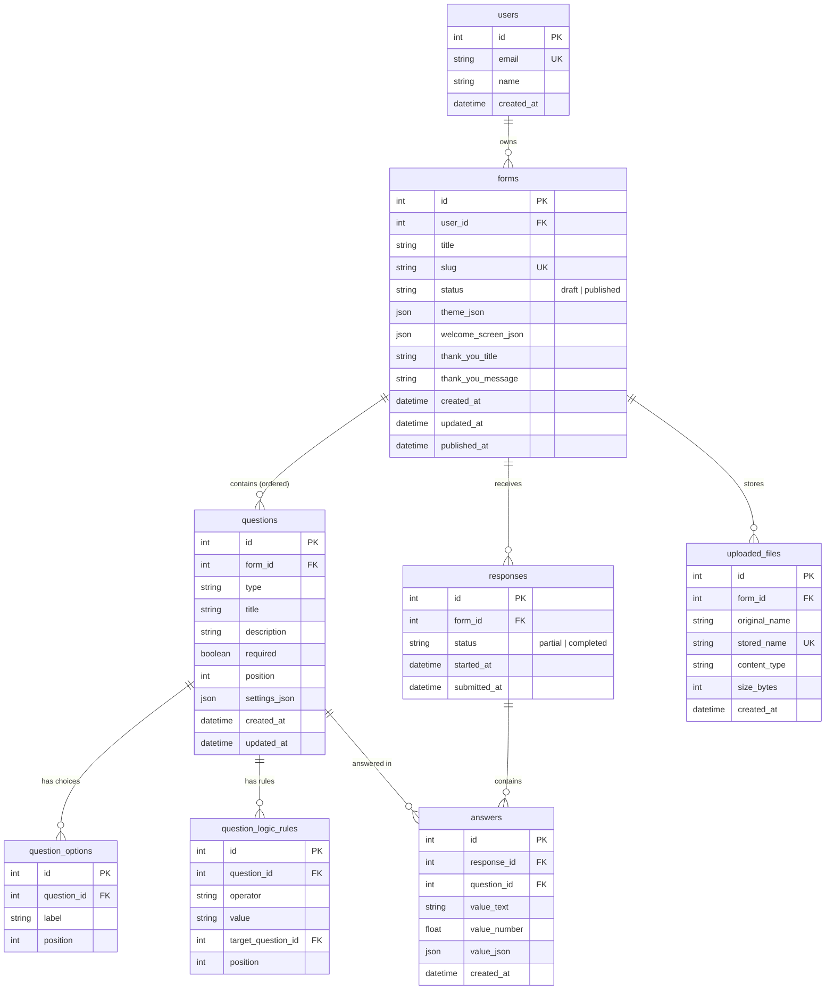

# Formly — Typeform Clone

> **SDE Fullstack Hiring Assignment:** A pixel-faithful, production-grade Typeform clone featuring the signature conversational one-question-at-a-time respondent flow, a 3-panel drag-and-drop builder, real-time database persistence, conditional logic jumps, file uploads, creator dark mode, and a complete results/analytics dashboard.

---

## 🌟 Demo & Overview

Formly recreates the core Typeform experience from the ground up:
- **Respondent Flow:** Conversational, one-question-at-a-time animated flow (`<FormRunner>`) with direction-aware transitions (up/down slide + fade), full keyboard controls (`Enter`, `↑/↓`, `A/B/C`, `Y/N`, `1-N`), Karla/Inter typography, and field-level validation.
- **3-Panel Form Builder:** Drag-and-drop question reordering with `@dnd-kit`, inline title/description editing, right-panel properties and logic jumps inspector, choices editor, and instant in-memory preview.
- **Workspace Dashboard:** Form cards with live status badges (`Draft` / `Published`), completed response counters, search, status filters, sorting, duplicate (with question and logic remapping), rename, delete with cascade, and share modal.
- **Results & Analytics:** 4 overview metric cards (Total Responses, Completed vs Partial, Completion Rate, Average Completion Time), visual per-question breakdowns across all 9 question types, paginated responses table with file downloads, slide-over answer drawer, and streaming CSV export.
- **Database Storage:** All data is stored in SQLite; sample data comes from the seed script (`seed.py`), featuring foreign key cascade deletion and server-side validation.

---

## 🏗 Tech Stack

| Layer | Technologies | Rationale |
|---|---|---|
| **Frontend** | Next.js 16 (App Router), TypeScript, Vanilla CSS + Tailwind CSS | High performance, static/dynamic hybrid rendering, strictly typed schemas. |
| **Animation** | Framer Motion | Direction-aware slide and fade transitions matching Typeform's signature feel. |
| **Drag & Drop** | `@dnd-kit/core`, `@dnd-kit/sortable` | Accessible, keyboard and pointer sortable lists for question ordering. |
| **Data Fetching** | TanStack Query (React Query) | Declarative caching, background refetching, optimistic updates, and cache invalidation. |
| **Typography** | Inter (UI & Builder) + Karla (Respondent Flow) | Exact font matching per Typeform design specifications. |
| **Backend** | Python FastAPI, Uvicorn | Async ASGI framework with native Pydantic v2 validation and auto-generated Swagger UI. |
| **ORM / DB** | SQLAlchemy 2.0 + SQLite (`PRAGMA foreign_keys=ON`) | Normalized relational schema with strict cascade deletes and clean migration readiness. |
| **Testing** | Pytest, HTTPX | Automated test suite validating models, cascade deletions, logic rules, file uploads, and metrics. |

---

## 📐 Database Schema & Architecture

The database architecture uses a **normalized 1-row-per-question** schema for answers rather than an untyped JSON blob. This ensures fast relational querying, aggregation for analytics, and integrity via foreign keys.



### Relational Design Decisions
1. **`answers` Table with Composite Uniqueness:**
   - Enforced by `UNIQUE(response_id, question_id)`.
   - Each answer row stores typed values (`value_text` for strings/emails, `value_number` for numeric ratings/scores, `value_json` for multiple-choice selections and file upload metadata `{ file_id, original_name }`).
2. **Explicit SQLite Foreign Key Cascades:**
   - SQLite disables foreign key constraints by default. Formly attaches an event listener to the engine:
     ```python
     @event.listens_for(Engine, "connect")
     def set_sqlite_pragma(dbapi_connection, connection_record):
         cursor = dbapi_connection.cursor()
         cursor.execute("PRAGMA foreign_keys=ON")
         cursor.close()
     ```
   - Deleting a form cascades immediately to delete all its questions, options, logic rules, responses, answers, and uploaded files without orphaned rows.
3. **Idempotent Database Seeder:**
   - Running `seed.py` seeds 1 user, 4 forms (3 published: `cust-feedback`, `tech-conf-2026`, `product-nps`; 1 draft: `Quarterly Team Pulse (Q4 Draft)`), all 9 question types, and 37 realistic responses (33 completed, 4 partial) with complete timestamp and answer variation.

---

## 📋 Supported Question Types (All 9)

| Type | Respondent Input | Keyboard Shortcuts | Validation Rules |
|---|---|---|---|
| **Short Text** | Clean single-line underlined input | `Enter` to continue | Required check, max length |
| **Long Text** | Multi-line auto-resizing textarea | `Enter` or `Shift+Enter` | Required check, max length |
| **Multiple Choice** | Card choices with letter badges (`A`, `B`, `C`...) | Key press `A`, `B`, `C`... | Required, choice must exist in options |
| **Yes / No** | Dual pill choice cards with `Y` and `N` badges | Key press `Y` or `N` | Required, boolean value |
| **Email** | Underlined input with email icon | `Enter` to continue | Required, RFC 5322 regex validation |
| **Number** | Clean numeric input with stepper controls | `Enter` to continue | Required, valid number, min/max bounds |
| **Rating** | 1 to N star rating buttons with numeric badges | Key press `1`, `2` ... `N` | Required, integer within `[1, max_rating]` |
| **Dropdown** | Custom searchable dropdown select menu | Arrow keys + `Enter` | Required, selection must match options |
| **File Upload** | Upload zone with file picker, size indicator, remove button | `Enter` to continue once uploaded | Required check, allowed extension, max size (default 10MB) |

---

## 🚀 REST API Reference

The backend exposes a fully documented REST API with interactive Swagger docs at `http://localhost:8000/docs`.

### 1. Forms CRUD (`/api/forms`)
| Method | Endpoint | Description |
|---|---|---|
| `GET` | `/api/forms` | List all forms owned by current user (with completed response counts). |
| `POST` | `/api/forms` | Create a new form in draft status. |
| `GET` | `/api/forms/{id}` | Get full form details including ordered questions, options, and logic rules. |
| `PATCH` | `/api/forms/{id}` | Update form title, theme configuration, or welcome/ending screens. |
| `DELETE` | `/api/forms/{id}` | Delete form (cascades to questions, rules, responses, answers, and stored files). |
| `POST` | `/api/forms/{id}/duplicate` | Deep-copy a form with all its questions, options, and remapped logic rules. |
| `POST` | `/api/forms/{id}/publish` | Publish form (sets status to `published` and generates unique URL slug). |
| `POST` | `/api/forms/{id}/unpublish` | Unpublish form back to `draft`. |

### 2. Questions CRUD
| Method | Endpoint | Description |
|---|---|---|
| `POST` | `/api/forms/{id}/questions` | Create a new question on the form (appends to end). |
| `PUT` | `/api/forms/{id}/questions/order` | Atomically reorder questions via transaction. |
| `PATCH` | `/api/questions/{id}` | Update question type, title, description, required status, settings, or options. |
| `DELETE` | `/api/questions/{id}` | Delete question, reindexes remaining questions, and purges dangling rules. |

### 3. Logic Rules CRUD (`/api/questions/{id}/logic-rules`)
| Method | Endpoint | Description |
|---|---|---|
| `GET` | `/api/questions/{id}/logic-rules` | List all forward logic jump rules for a question. |
| `POST` | `/api/questions/{id}/logic-rules` | Create a forward logic rule (`operator`, `value`, `target_question_id`, `position`). |
| `PUT` | `/api/questions/{id}/logic-rules/{rule_id}` | Update an existing logic rule. |
| `DELETE` | `/api/questions/{id}/logic-rules/{rule_id}` | Delete a logic rule. |

### 4. Public Respondent Flow (`/api/public`)
| Method | Endpoint | Description |
|---|---|---|
| `GET` | `/api/public/forms/{slug}` | Fetch published form definition (returns 404 for draft forms). |
| `POST` | `/api/public/forms/{slug}/responses` | Submit completed response. Promotes partial response if `response_id` provided. |
| `POST` | `/api/public/forms/{slug}/responses/progress` | Track partial response progress. Creates or updates partial response and returns `{ response_id }`. |
| `POST` | `/api/public/forms/{slug}/uploads` | Upload respondent file (multipart/form-data). Validates size and extension. |

### 5. Responses & Analytics
| Method | Endpoint | Description |
|---|---|---|
| `GET` | `/api/forms/{id}/responses` | Paginated response list (`page`, `page_size`). |
| `GET` | `/api/responses/{id}` | Get single response with answers mapped per question. |
| `DELETE` | `/api/responses/{id}` | Delete individual response (cascades to uploaded files on disk). |
| `GET` | `/api/forms/{id}/summary` | Aggregated metrics: completed vs partial, completion rate, avg duration, per-question stats. |
| `GET` | `/api/forms/{id}/responses/export.csv` | Live streaming CSV export with dynamic question headers and file names. |

### 6. File Downloads (`/api/files`)
| Method | Endpoint | Description |
|---|---|---|
| `GET` | `/api/files/{file_id}` | Owner-scoped file download for creators. |

---

## ⚙️ Environment Variables

### Backend (`backend/.env.example`)
| Variable | Default | Description |
|---|---|---|
| `DATABASE_URL` | `sqlite:///./typeform.db` | SQLAlchemy SQLite database connection string |
| `CORS_ORIGINS` | `http://localhost:3000,http://127.0.0.1:3000` | Comma-separated list of allowed CORS origins |
| `SEED_ON_START` | `false` | When `true`, automatically seeds database if empty on startup |
| `PORT` | `8000` | Backend API port |
| `UPLOAD_DIR` | `./uploads` | Directory path for storing uploaded files |
| `MAX_UPLOAD_MB` | `10` | Maximum allowable file upload size in megabytes |
| `ALLOWED_UPLOAD_EXTENSIONS` | `.pdf,.png,.jpg,.jpeg,.gif,.doc,.docx,.xls,.xlsx,.csv,.txt,.zip` | Permitted file extensions |

### Frontend (`frontend/.env.example`)
| Variable | Default | Description |
|---|---|---|
| `NEXT_PUBLIC_API_URL` | `http://localhost:8000` | Base URL pointing to the FastAPI backend service |

---

## 💻 Local Development Setup

### Prerequisites
- **Python:** 3.10+ (tested on Python 3.13)
- **Node.js:** 18+ (tested on Node.js 20+)
- **Git**

### 1. Clone the Repository
```bash
git clone https://github.com/yashraj-shishodia/Formly.git
cd Formly
```

### 2. Backend Setup
```bash
cd backend

# Create and activate virtual environment
python3 -m venv venv
source venv/bin/activate  # On Windows: venv\Scripts\activate

# Install dependencies
pip install -r requirements.txt

# Run automated test suite (24 tests)
PYTHONPATH=. pytest tests/ -q

# Seed database with sample forms and 37 responses
PYTHONPATH=. python3 app/seed.py

# Start FastAPI development server
uvicorn app.main:app --reload --port 8000
```
- API is running at: `http://localhost:8000`
- Swagger UI Documentation: `http://localhost:8000/docs`

### 3. Frontend Setup
In a new terminal window:
```bash
cd frontend

# Install dependencies
npm install

# Start Next.js development server
npm run dev
```
- App is running at: `http://localhost:3000`
- Forms Builder: `http://localhost:3000/forms/1/edit`
- Respondent Flow: `http://localhost:3000/f/cust-feedback`
- Results Dashboard: `http://localhost:3000/forms/1/results`

---

## 🚢 Deployment Guide

### Deploying Backend (Render / Railway / Fly.io)
The backend includes automatic startup seeding.

#### Option A: Render (Web Service)
1. Fork or push this repository to GitHub.
2. In the Render Dashboard, click **New > Web Service** and connect your repo.
3. Configure the service:
   - **Root Directory:** `backend`
   - **Environment:** `Python 3`
   - **Build Command:** `pip install -r requirements.txt`
   - **Start Command:** `uvicorn app.main:app --host 0.0.0.0 --port $PORT`
4. Add Environment Variables:
   - `DATABASE_URL`: `sqlite:///./typeform.db`
   - `CORS_ORIGINS`: `http://localhost:3000,https://<your-frontend>.vercel.app`
   - `SEED_ON_START`: `true` (ensures database automatically seeds on first launch)
   - `UPLOAD_DIR`: `./uploads`
   - `MAX_UPLOAD_MB`: `10`
   - `ALLOWED_UPLOAD_EXTENSIONS`: `.pdf,.png,.jpg,.jpeg,.gif,.doc,.docx,.xls,.xlsx,.csv,.txt,.zip`

#### Option B: Render Blueprint (`render.yaml`)
A ready-to-use [`render.yaml`](./render.yaml) is included in the root directory for automated deployment.

---

### Deploying Frontend (Vercel)
1. In the Vercel Dashboard, click **Add New > Project** and import the repository.
2. Configure project settings:
   - **Root Directory:** Click Edit and select `frontend`.
   - **Framework Preset:** `Next.js`.
3. Add Environment Variables:
   - `NEXT_PUBLIC_API_URL`: `https://<your-backend-service>.onrender.com`
4. Click **Deploy**.
5. Once deployed, update the backend's `CORS_ORIGINS` environment variable to include your Vercel production URL.

---

## 🧪 Automated Testing

Formly features an automated pytest test suite covering the full database and API lifecycle:

```bash
cd backend
PYTHONPATH=. pytest tests/ -v
```

### Test Coverage Highlights:
- `test_health_and_models.py`:
  - Health check endpoint verification (`GET /api/health`).
  - Table existence check for all tables.
  - Foreign key cascade deletion test (deleting a form cascades to its questions, options, responses, and answers).
- `test_routers.py`:
  - Forms CRUD, deep duplication, and publish/unpublish workflow.
  - Public flow verification (404 on draft, 200 on published).
  - Partial response tracking (`POST /api/public/forms/{slug}/responses/progress`) and promotion to completed.
  - Question type persistence and default configuration.
- `test_logic.py`:
  - Logic jump evaluation (`equals`, `not_equals`, `greater_than`, `less_than`).
  - First-match rule ordering and backward jump rejection (422).
  - Skipping jumped-over required questions while validating visited required questions.
  - Form duplication with logic rules remapped.
- `test_uploads.py`:
  - Multipart file upload validation (max size check, disallowed file type rejection).
  - Draft form upload rejection and path-traversal filename sanitization.
  - Answer submission validation for file upload question type.
  - Creator-only file download permissions.
  - Cascade cleanup of uploaded files on disk upon form and response deletion.
- `test_seed_and_metrics.py`:
  - Seeder idempotency test (running seed twice does not duplicate records).
  - Summary metrics calculations (completion rate %, average duration in seconds).
  - Theme and welcome/ending screen configuration storage.

---

## 📌 Assumptions, Placeholders & Known Limitations

1. **Simplified Authentication:** Every creator route operates against the default creator user defined in `backend/app/dependencies.py` without a separate login or session screen; public respondent forms require no authentication.
2. **Seed Data & Partial Response Coexistence:** Seeded partial responses coexist with live partial response tracking generated via the progress endpoint.
3. **Placeholders Present:** The following navigation tabs and content items remain designated placeholders (marked with "Coming Soon"):
   - **Workflow Tab** (`Coming Soon`)
   - **Connect Tab** (`Coming Soon`)
   - **Templates** (`Coming Soon`)
   - **Team** (`Coming Soon`)
   - **Payment** (`Coming Soon`)
   - **Video** (`Coming Soon`)
   - **AI Prompt Box** (`Coming Soon` placeholder: creates a blank form titled from the prompt)
4. **Local Ephemeral Storage:** The SQLite database file and uploaded files reside on the host's local filesystem, which is ephemeral on free-tier platforms such as Render's free tier.

---

## 📄 License
This project was built as a fullstack engineering assignment. Open-source under the MIT License.
